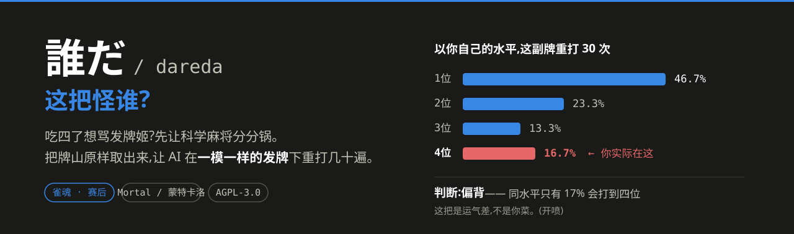

# 誰だ / dareda

## 这把怪谁?

恶调吃四了 想骂人。先不要骂 让科学麻将来分分锅 看看你和发牌姬谁的锅更大。
dareda 把牌山取出来,让 AI 在**一模一样的发牌**下把这局
重打几十遍,然后告诉你一个名次分布——这局的结果,有多少是牌、多少是打法。

```
座1 同水平自打分布  n=30  平均顺位 2.00
    1位  46.7%  ████████████████
    2位  23.3%  ████████
    3位  13.3%  ████
    4位  16.7%  ██████

实际 4 位;同水平自打期望 2.00 位。
  判断:偏背 —— 你的同水平只有 17% 会打到 4 位或更差
```

翻译一下:以你自己的水平重打这副牌,平均能到 2 位,只有 17% 会像那局一样吃四。
这把,是运气差,不是你菜。（开喷！

## 三条须知

- **只用来复盘打完的牌。** 不要用于正在进行的对局。
- **取牌谱需要在浏览器里改雀魂客户端,可能违反用户协议、有封号风险。** 用不用你自己
  决定,建议用小号。
- **本项目不含 AI 模型,也不提供模型权重**(安装脚本会自动从第三方下)。许可证
  AGPL-3.0,详见 [NOTICE](NOTICE)。

## 装

先自己装好 **Python 3.11+** 和 **Rust 工具链**(https://rustup.rs)。**Windows 用户请把项目
放在短路径**(如 `C:\dev\dareda`),别放很深的目录,否则装 torch 会失败(见文末排错)。

然后跑一键安装脚本,它会建虚拟环境、装依赖、编译引擎、下模型权重:

```bash
git clone https://github.com/DKIV9570/Dareda.git dareda && cd dareda

# Windows(PowerShell):
.\install.ps1

# Linux / macOS:
bash install.sh
```

脚本可以重复跑——中途出错(比如忘了装 Rust)修好再跑一遍,它会跳过已完成的步骤,
不会重下权重或重新编译。装完照它最后打印的提示激活环境即可。

<details>
<summary>不想用脚本?手动装的步骤在这里</summary>

```bash
python -m venv .venv && .venv\Scripts\activate       # Linux/macOS: source .venv/bin/activate
pip install -e .
pip install numpy torch --index-url https://download.pytorch.org/whl/cpu   # 只用 CPU;要 GPU 去 pytorch.org 选命令

git clone --depth 1 https://github.com/Equim-chan/Mortal.git vendor/Mortal
cp patches/replay.rs vendor/Mortal/libriichi/src/arena/replay.rs
git -C vendor/Mortal apply ../../patches/arena-mod.patch
cd vendor/Mortal/libriichi && cargo build --release && cd ../../..

cp vendor/Mortal/target/release/riichi.dll  libriichi.pyd     # Windows
# cp vendor/Mortal/target/release/libriichi.so libriichi.so   # Linux/macOS

mkdir -p models && curl -L -o models/mortal_298k.pth \
  https://huggingface.co/VoidShine/mortal-298k/resolve/main/mortal_298k.pth
```
</details>

每次开新终端用之前,激活环境并设好 `PYTHONPATH`:

```bash
export PYTHONPATH="src:vendor/Mortal/mortal:."      # Windows 用分号: "src;vendor/Mortal/mortal;."
python -c "import libriichi; print(libriichi.__profile__)"   # 输出 release 就对了
```

## 取牌谱

1. 装 [Tampermonkey](https://www.tampermonkey.net/),把
   [tools/majsoul-ws-capture.user.js](tools/majsoul-ws-capture.user.js) 全文粘进去并启用。
2. **刷新雀魂页面**(脚本要在开局前就生效,不刷新没用)。
3. 登录 → 点开要分析的牌谱 → 等回放界面出来 → 点右下角的「⬇ 导出牌谱」按钮,
   浏览器会下一个 `majsoul-ws-*.json`。
4. 解码并自检:

```bash
dareda decode-capture --capture majsoul-ws-*.json --out record.json
dareda verify --record record.json     # 必须全过,不过就别往下跑了
```

取牌谱遇到问题看 [tools/README.md](tools/README.md)。

## 用

### 最省事:图形界面

双击 **`gui.cmd`**(Windows)或跑 `bash gui.sh`(Linux/macOS),打开一个小窗口:
选牌谱 → 点自己是哪一家 → 开始分析,看着进度条走完就出结论。

（Linux 若报 `No module named 'tkinter'`,装一下:`sudo apt install python3-tk`。）

### 或者:命令行一键脚本

不想要窗口的话,双击 **`run.cmd`**(Windows)或 `bash run.sh`,它会自动找到你刚导出的
抓包文件、解码、自检,列出四家让你选座,跑出结论。也可以把牌谱文件直接拖到 `run.cmd` 上。

### 或者用命令

先看一眼这局的信息,顺便确认你是几号座(按昵称认):

```bash
dareda inspect --record record.json
```

然后挑一个跑(`--hero` 填你的座次 0–3):

```bash
# 最推荐:一条命令给结论 —— 牌、打法、运气各占多少锅
dareda diagnose --record record.json --hero 1

# 只想看运气:以你自己的水平重打 30 次
dareda self-luck --record record.json --hero 1 --trials 30

# 四家都换成顶尖 AI,看这副牌能打成什么样
dareda replay --record record.json

# 对手照你那局原样打,只有你换成 AI
dareda counterfactual --record record.json --hero 1

# 把结果跑成分布,并试几档对手强度
dareda montecarlo --record record.json --hero 1 --trials 20 --sensitivity
```

`diagnose` / `self-luck` / `montecarlo` 会**按你的 CPU 自动多进程并行**(默认最多 4 个,
为控内存;每进程各要一份 ~130MB 权重)。核多的话加 `--jobs 8` 更快,`--jobs 1` 关掉并行。
并行不影响结果——同样的种子,几个进程都出一样的数。有显卡再加 `--device cuda:0`。

### `diagnose` 输出长这样

```
  牌   ★★★★☆  好牌     均等水平下,这个座位期望 2.31 位
  打   ★★★☆☆  打得一般  你的打法把期望推到 2.20 位(+0.11)
  运   ☆☆☆☆☆  运气背    你的同水平里,4 位或更差占 17%

  → 好牌,打得一般,而且这把运气还背。

  名次分解(以 2.5 位为中性起点,正数=对你有利):
    牌与座次 +0.19  +  打法 +0.11  +  运气 -1.80  =  -1.50
```

还会给出一条名次概率横条:**这副牌上,以你自己的水平各名次的概率**,并标出你实际的
落点(▲)。所以"吃四=运气差"不再是黑箱——你直接看到"我这水平这副牌大多几位"。

**运气怎么判**(严谨定义,不是拍脑袋):把你的实际名次放进上面那条分布,算它落在
"你自己水平"的哪个分位——**落在坏的 1/4 端 → 运气背,好的 1/4 端 → 运气顺,中间
50% → 愿赌服输**。用分位而不是"和均值差多少",双峰分布里才不会把常见的 4 位误判成惨背。

牌与打法两项相加加上运气残差恒等于「实际名次距中性的偏差」,是闭合分解不是拍脑袋的
权重。diagnose 跑两条基线(均等水平定牌/座,真实水平定打法+运气分布),`--trials 30`
下 CPU 上约几分钟(已自动多进程)。「打法」那颗星是这副牌上的名次增量,少量次数下有
噪声、会在边界抖;判水平更稳的是结果里直接标出的 **EV loss 排名**(逐决策直接测,不抖)。

## 结果别读歪了

- **别拿单次的一个名次下结论。** 麻将单局运气极大,要看 `self-luck` / `montecarlo`
  跑出来的**分布**。
- **`self-luck` 给的是运气方向,不是精确概率。** 它拿你这一局的发挥当"你的水平"来估,
  样本就一场,看个大概就好。
- **`counterfactual` 里保真度低的局别当真。** 你一旦打得和原局不同,对手就没法照原样
  跟了,后面基本是 AI 在互打。输出里每局都标了保真度。
- **它证明不了"恶调"。** 判平台公不公平要几万局的统计,这工具只帮你看懂自己这一局。
- **简单来说就是图一乐**

## 命令一览

| 命令 | 干什么 |
|---|---|
| `decode-capture` | 抓包文件 → 牌谱 |
| `verify` | 检查牌山取对没有(分析前必跑) |
| `inspect` | 看这局的序列、玩家、终局 |
| `diagnose` | 牌 / 打法 / 运气各占多少锅 ← **先跑这个** |
| `self-luck` | 以你自己的水平重打,看运气好坏 |
| `replay` | 四家全换顶尖 AI |
| `counterfactual` | 只有你换 AI,对手照原样打 |
| `montecarlo` | 跑成分布 + 对手强度敏感性 |

## 遇到问题

**`import torch` 报 `No module named 'torchgen'`,或装 torch 报 `WinError 206 文件名太长`**
路径太长了(Windows 260 字符上限,torch 的包目录很深)。删掉整个 `.venv`,把项目挪到
短路径(如 `C:\dev\dareda`)重装。或者用管理员 PowerShell 开启长路径:
```powershell
New-ItemProperty -Path "HKLM:\SYSTEM\CurrentControlSet\Control\FileSystem" `
  -Name "LongPathsEnabled" -Value 1 -PropertyType DWORD -Force
```

**`import libriichi` 报 `dynamic module does not define module export function`**
编译产物文件名不对——要把 `riichi.dll` 复制成 `libriichi.pyd`(Linux/macOS 是
`libriichi.so`)。用安装脚本会自动做好;手动装漏了这步才会碰到。

**打补丁(`git apply`)失败**
上游改动导致补丁对不上。手动往 `vendor/Mortal/libriichi/src/arena/mod.rs` 加这四行即可:
```rust
mod replay;
pub use replay::{KyokuOutcome, KyokuReplay};
m.add_class::<KyokuReplay>()?;      // 加在 register_module 里其它 add_class 旁边
m.add_class::<KyokuOutcome>()?;
```

**编辑器里冒出两个 git 仓库,不小心提交到了 Mortal**
`vendor/Mortal` 是上游的克隆,别往里提交。本项目自带的 `.vscode/settings.json` 已经把它
藏掉了;真提交进去了也推不上去(没权限),撤销即可:
```bash
git -C vendor/Mortal reset --mixed HEAD~1
```

**装完把别的 Python 项目搞坏了**
你手动装时没用虚拟环境。dareda 依赖较新的 protobuf,可能顶掉你环境里的旧版本。用
安装脚本就不会有这问题(它会自动建独立的 `.venv`)。

## 许可证

AGPL-3.0-or-later,见 [LICENSE](LICENSE) 与 [NOTICE](NOTICE)。本项目不含 Mortal 代码
(只有补丁)、不分发模型权重。上游 Mortal 由 [Equim-chan](https://github.com/Equim-chan/Mortal)
开发。

有问题或者想参与开发的话欢迎fork/NGA 私信我 ID dkiv9570
